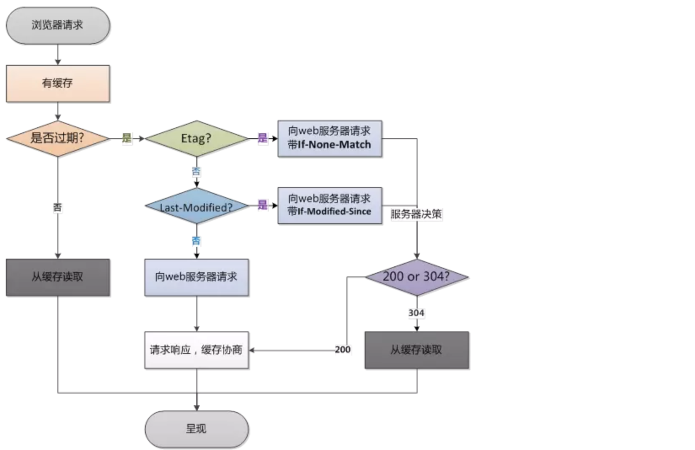

# HTTP

### 1. 请求方法

- **GET** 用于请求服务器的资源
- **POST** 发送数据给服务器
- **PUT** 用于新增资源或者使用请求中的有效负载替换目标资源的表现形式
- **DELETE** 用于删除指定的资源
- **OPTIONS** 获取目标资源支持的通信选项
- **TRACE** 回显服务器收到的请求，主要用于测试或诊断
- **PATCH** 用于对资源进行部分修改
- CONNECT HTTP/1.1 预留能够将连接改为管道方式的代理服务器

> GET 和POST的区别

- 数据传输方式不同： GET请求通过URL传输请求数据，POST通过数据请求的body传输
- 安全性不同：POST请求的数据在body中，安全性有一定的保证；GET请求的数据在URL中，通过历史记录和缓存很容易查到。
- GET无害：刷新、后退浏览器操作GET请求是无害的，POST可能会重复提交
- 特性不同：GET请求是安全且幂等的（请求不会改变数据和服务器的状态）；POST请求是非安全非幂等的
- **GET 产生一个 TCP 数据包；POST 产生两个 TCP 数据包**。

> PUT和POST的区别

PUT 和POST方法的区别是,PUT方法是幂等的：连续调用一次或者多次的效果相同（无副作用），而POST方法是非幂等的。

通常情况下，PUT的URI指向是具体单一资源，而POST可以指向资源集合

> PUT 和PATCH的区别

PUT和PATCH都是更新资源，而PATCH用来对已知资源进行局部更新

```json
user = {
	name: 'xxx',
	id: '123',
	email: 'ss@ww.com'
}

// PUT 请求时发送整个数据结构
// PATCH 请求发送的 是部分数据 { name: 'yy' }
```

### 2. 缓存机制

- 浏览器在请求某一资源时，会先获取该资源缓存的header信息，判断是否命中强缓存（cache-control和expires信息），若命中直接从缓存中获取资源信息，包括缓存header信息，本次请求就不会与服务器进行通信。

- 如果没有命中强缓存，浏览器会发送请求到服务器，请求会携带第一次返回的有关缓存的header字段信息（Last-Modifued/If-Modified-Since和Etag/If-None-Match），由服务器根据header信息来比对结果是否协商缓存命中。若命中，则服务器返回新的响应header信息更新缓存中的对应header信息，但是不返回资源内容，它会告知浏览器可以直接从缓存获取；否则返回最新的资源内容。

> 强制缓存和协商缓存的区别

| 缓存     | 获取资源形式 | 状态吗              | 发送请求到服务器                     |
| -------- | ------------ | ------------------- | ------------------------------------ |
| 强缓存   | 从缓存取     | 200（from cache）   | 否，直接从缓存取                     |
| 协商缓存 | 从缓存取     | 304（not modified） | 是，通过服务器告知浏览器缓存是否可用 |

> ##### Cache-control策略

Cache-Control与Expires的作用一致，都是指明当前资源的**有效期**，控制浏览器是否直接从浏览器缓存取数据还是重新发请求到服务器取数据。只不过Cache-Control的选择更多，设置更细致，**如果同时设置的话，其优先级高于Expires。**

> ##### 为什么既有Last-Modified还有Etag(两者为什么并存，有什么好处)

你可能会觉得使用Last-Modified已经足以让浏览器知道本地的缓存副本是否足够新，为什么还需要Etag呢？HTTP1.1中Etag的出现主要是为了解决几个Last-Modified比较难解决的问题：

一些文件也许会周期性的更改，但是他的内容并不改变(仅仅改变的修改时间)，这个时候我们并不希望客户端认为这个文件被修改了，而重新GET；
某些文件修改非常频繁，比如在秒以下的时间内进行修改，(比方说1s内修改了N次)，If-Modified-Since能检查到的粒度是s级的，这种修改无法判断(或者说UNIX记录MTIME只能精确到秒)；
某些服务器不能精确的得到文件的最后修改时间。
这时，利用Etag能够更加准确的控制缓存，因为Etag是服务器自动生成或者由开发者生成的对应资源在服务器端的唯一标识符。
Last-Modified与ETag是可以一起使用的，服务器会优先验证ETag，一致的情况下，才会继续比对Last-Modified，最后才决定是否返回304。



### 3. HTTP请求头以及含义

```
POST http://www.baidu.com  HTTP/1.1    // 请求行
Host： 127.0.0.2:80 //请求解析的地址
Content-Type：application/json//请求的数据类型
Content-Length： 22
Referer： www.baidu.com // 请求原始的url
User-Agent： Mozila ... //浏览器的环境信息
Accept: 'text/html' //接收的数据类型
//空行
user=xxx&ID=1122  //请求的正文
```

### 4. 响应头

```
HTTP/1.1 200 OK
Date: Tue, 10 Jul 2012 06:15:01 GMT
Content-Type: application/json
Content-Length: 32

<html>
	....
</html>
```

### 5. 状态码

**1xx 消息**

| 100  | continue            | 继续。应继续其请求 |
| ---- | ------------------- | ------------------------------------------------------------ |
| 101  | Switching Protocols | 切换协议。服务器根据客户端的请求切换协议。只能切换到更高级的协议 |

**2xx 成功**

| 200  | OK       | 请求成功                           |
| ---- | -------- | ---------------------------------- |
| 201  | Created  | 已创建。成功请求并创建了新的资源   |
| 202  | Accepted | 已接受。已经接受请求，但未处理完成 |

**3xx 重定向**

| 300  | Multiple Choices   | 多种选择。请求的资源可包括多个位置，相应可返回一个资源特征与地址的列表用于用户终端（例如：浏览器）选择 |
| ---- | ------------------ | ------------------------------------------------------------ |
| 301  | Moved Permanently  | 永久移动。请求的资源已被永久的移动到新URI，返回信息会包括新的URI，浏览器会自动定向到新URI。今后任何新的请求都应使用新的URI代替 |
| 302  | Found              | 临时移动。与301类似。但资源只是临时被移动。客户端应继续使用原有URI |
| 304  | Not Modified       | 未修改。所请求的资源未修改，服务器返回此状态码时，不会返回任何资源。客户端通常会缓存访问过的资源，通过提供一个头信息指出客户端希望只返回在指定日期之后修改的资源 |
| 307  | Temporary Redirect | 临时重定向。与302类似。使用GET请求重定向                     |

**4xx 客户端错误**

| 400  | Bad Request        | 客户端请求的语法错误，服务器无法理解                         |
| ---- | ------------------ | ------------------------------------------------------------ |
| 401  | Unauthorized       | 请求要求用户的身份认证                                       |
| 403  | Forbidden          | 服务器理解请求客户端的请求，但是拒绝执行此请求               |
| 404  | Not Found          | 服务器无法根据客户端的请求找到资源（网页）。通过此代码，网站设计人员可设置"您所请求的资源无法找到"的个性页面 |
| 405  | Method Not Allowed | 客户端请求中的方法被禁止                                     |

**5xx 服务段错误**

| 500  | Internal Server Error | 服务器内部错误，无法完成请求                                 |
| ---- | --------------------- | ------------------------------------------------------------ |
| 502  | Bad Gateway           | 作为网关或者代理工作的服务器尝试执行请求时，从远程服务器接收到了一个无效的响应 |
| 503  | Service Unavailable   | 由于超载或系统维护，服务器暂时的无法处理客户端的请求。延时的长度可包含在服务器的Retry-After头信息中 |
| 504  | Gateway Time-out      | 充当网关或代理的服务器，未及时从远端服务器获取请求           |

### 6. 302、303、307的区别

> 从实际效果看：302 允许各种各样的重定向，一般情况下都会实现为到 GET 的重定向，但是不能确保 POST 会重定向为 POST；而 303 只允许任意请求到 GET 的重定向；307 和 302 一样，除了不允许 POST 到 GET 的重定向。

### 7. HTTPS和HTTP的区别

https是安全版的http，因为http协议的数据都是明文进行传输的，所以对于一些敏感信息的传输就很不安全，HTTPS就是为了解决HTTP的不安全而生的。

### 8. HTTPS如何保证安全

**对称加密**：即通信的双方都使用同一个秘钥进行加解密，比如特务接头的暗号，就属于对称加密

对称加密虽然很简单性能也好，但是无法解决首次把秘钥发给对方的问题，很容易被hacker拦截秘钥。

**非对称加密：**

1. 私钥 + 公钥= 密钥对
2. 即用私钥加密的数据,只有对应的公钥才能解密,用公钥加密的数据,只有对应的私钥才能解密
3. 因为通信双方的手里都有一套自己的密钥对,通信之前双方会先把自己的公钥都先发给对方
4. 然后对方再拿着这个公钥来加密数据响应给对方,等到到了对方那里,对方再用自己的私钥进行解密

非对称加密虽然安全性更高，但是带来的问题就是速度很慢，影响性能。

**解决方案：**

那么结合两种加密方式，将对称加密的密钥使用非对称加密的公钥进行加密，然后发送出去，接收方使用私钥进行解密得到对称加密的密钥，然后双方可以使用对称加密来进行沟通。

此时又带来一个问题，中间人问题：

如果此时在客户端和服务器之间存在一个中间人,这个中间人只需要把原本双方通信互发的公钥,换成自己的公钥,这样中间人就可以轻松解密通信双方所发送的所有数据。

所以这个时候需要一个安全的第三方颁发证书（CA），证明身份的身份，防止被中间人攻击。

证书中包括：签发者、证书用途、使用者公钥、使用者私钥、使用者的HASH算法、证书到期时间等

但是问题来了，如果中间人篡改了证书，那么身份证明是不是就无效了？这个证明就白买了，这个时候需要一个新的技术，数字签名。

数字签名就是用CA自带的HASH算法对证书的内容进行HASH得到一个摘要，再用CA的私钥加密，最终组成数字签名。

当别人把他的证书发过来的时候,我再用同样的Hash算法,再次生成消息摘要，然后用CA的公钥对数字签名解密,得到CA创建的消息摘要,两者一比,就知道中间有没有被人篡改了。

这个时候就能最大程度保证通信的安全了。

### 9. HTTPS的请求过程


1. 浏览器将自己支持的一套加密规则发送给网站。
2. 网站从中选出一组加密算法与HASH算法，并将自己的身份信息以证书的形式发回给浏览器。证书里面包含了网站地址，加密公钥，以及证书的颁发机构等信息。
3. 获得网站证书之后浏览器要做以下工作：
      a. 验证证书的合法性（颁发证书的机构是否合法，证书中包含的网站地址是否与正在访问的地址一致等），如果证书受信任，则浏览器栏里面会显示一个小锁头，否则会给出证书不受信的提示。
      b. 如果证书受信任，或者是用户接受了不受信的证书，浏览器会生成一串随机数的密码，并用证书中提供的公钥加密。
      c. 使用约定好的HASH计算握手消息，并使用生成的随机数对消息进行加密，最后将之前生成的所有信息发送给网站。
4. 网站接收浏览器发来的数据之后要做以下的操作：
      a. 使用自己的私钥将信息解密取出密码，使用密码解密浏览器发来的握手消息，并验证HASH是否与浏览器发来的一致。
      b. 使用密码加密一段握手消息，发送给浏览器。
5. 浏览器解密并计算握手消息的HASH，如果与服务端发来的HASH一致，此时握手过程结束，之后所有的通信数据将由之前浏览器生成的随机密码并利用对称加密算法进行加密。

### 10. HTTP2 相对HTTP/1.X的优势

- 新的二进制格式（Binary Format）：HTTP1.x的解析是基于文本。基于文本协议的格式解析存在天然缺陷，文本的表现形式有多样性，要做到健壮性考虑的场景必然很多，二进制则不同，只认0和1的组合。基于这种考虑HTTP2.0的协议解析决定采用二进制格式，实现方便且健壮。
- 多路复用（MultiPlexing）：即连接共享，即每一个request都是是用作连接共享机制的。一个request对应一个id，这样一个连接上可以有多个request，每个连接的request可以随机的混杂在一起，接收方可以根据request的 id将request再归属到各自不同的服务端请求里面。
- header压缩：如上文中所言，对前面提到过HTTP1.x的header带有大量信息，而且每次都要重复发送，HTTP2.0使用了专门为首部压缩而设计的 HPACK 算法，使用encoder来减少需要传输的header大小，通讯双方各自cache一份header fields表，既避免了重复header的传输，又减小了需要传输的大小。
- 服务端推送（server push）：服务端推送能把客户端所需要的资源伴随着index.html一起发送到客户端，省去了客户端重复请求的步骤。正因为没有发起请求，建立连接等操作，所以静态资源通过服务端推送的方式可以极大地提升速度。例如我的网页有一个sytle.css的请求，在客户端收到sytle.css数据的同时，服务端会将sytle.js的文件推送给客户端，当客户端再次尝试获取sytle.js时就可以直接从缓存中获取到，不用再发请求了。

### 11. HTTP 1.1 新增功能

- 浏览器缓存
- 新的method 除了get/post之外所有的方法
- 连接复用，节省了多次打开TCP连接加载网页文档资源的时间。
- `Host` 头，能够使不同域名配置在同一个IP地址的服务器上。
- 支持响应分块。
- 增加流水线操作，允许在第一个应答被完全发送之前就发送第二个请求，以降低通信延迟。

