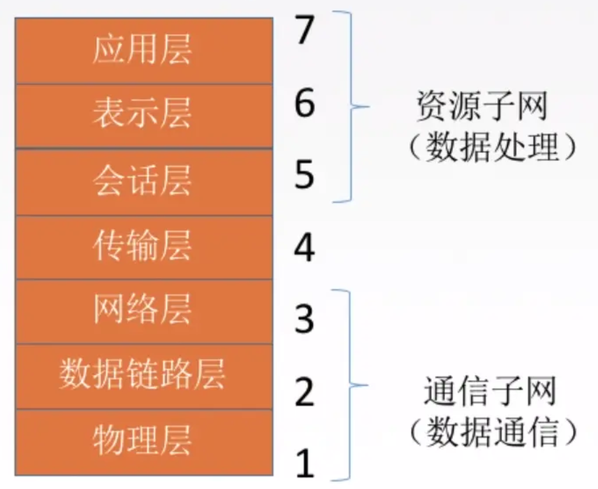

# 计算机网络

### 1. OSI 七层协议

### 2. 传输层协议（TCP/UDP）

#### 2.1 端口号的作用

> 端口号可以用来标识同一个主机上通信的不同应用程序（就是哪个应用程序在使用这个端口）。

那为什么一个端口只能分配给一个应用程序，不能是多个呢？

如果服务器有两个应用程序`A，B`，分别启动了A服务和B服务，它们监听同一个端口，那有数据来的时候，服务器无法判断这个数据到底是给A，还是给B。

####  2.2 UDP协议

UDP协议是参考模型中一种`无连接`的传输层协议，提供面向事务的简单不可靠信息传送服务。

> （1） UDP协议的特点

- UDP是`无连接的`，减少开销和发送数据之前的时间延迟。大家都知道`TCP`的`三次握手和四次分手`，这个是需要时间花销的，但是UDP没有这部分花销。
- UDP使用`最大努力交付`，即不保证可靠交付。那谁来保证可靠的交付呢？是由UDP的上一层协议，应用层来保证。
- UDP是`面向报文的`，适合一次性传输少量数据的网络应用。什么意思呢，如下图，UDP这层，把应用层的全部内容作为自己的数据报部分，在IP层也只是加了一个IP首部，我们知道，在以太网，链路层上的数据如果超过1500字节，就会分片，所以网络层发现上面传输层给了`太大的数据就会分片`，加上UDP是不可靠的协议，这就加大了UDP的`不可靠性`，容易丢失，所以UDP适合数据量少的。
- UDP没有拥塞控制，适合很多实时应用。也就是说如果网络堵塞，UDP不管那么多，照样按照自己的速率发数据，那有些人就会说，这协议是不是有点坑B，路都堵上了，还发死劲发数据呢，但是反过来看，这也是UDP的优点，它允许丢包，如果你的网络情况还不错，UDP就非常适合实时应用，比如视频会议。
- UDP首部较小，只有8字节，而TCP由20字节。这也是`减少网络传输开销`的一方面。

####  2.3 TCP协议

##### 2.3.1 特点

> TCP协议简单来说是一种位于传输层的，面向连接的、可靠的、基于字节流的传输层通信协议 TCP协议的特点:

- TCP是`面向连接`的传输层协议。比如说TCP的三次握手，四次分手，针对的都是连接。
- 每一条TCP连接`只能有两个端点`，每一条TCP连接是点对点的。`也就是说TCP是不同计算机之间的进程的通信`。
- TCP提供可靠交付的服务，无差错，不丢失，不重复，按序到达。总结一下就是，`可靠有序，不丢不重`。
- TCP提供`全双工通信`。全双工指的是连接双方可以同时收发数据。在收发两端都有发送缓存和接收缓存，发送缓存就是一个准备发送的队列，接收缓存是一个准备接收的队列。
- TCP`面向字节流`。

##### 2.3.2 建立连接

##### 2.3.3 释放连接

> 为什么最后还要等待两个时间周期呢？

- 客户端的最后一个`ACK`报文在传输的时候丢失，服务器并没有接收到这个报文。这个候时候服务器就会超时重传这个`FIN`消息，然后客户端就会重新返回最后一个`ACK报文`，等待两个时间周期，完成关闭。
- 如果不等待这两个时间周期，服务器重传的那条消息就不会收到。服务器就因为接收不到客户端的信息而无法正常关闭。

##### 2.3.4 TCP三次握手和四次分手相关的面试题

> 为什么连接的时候是三次握手，关闭的时候却是四次握手？

- 关闭连接时，服务器收到对方的`FIN`报文时，仅仅表示对方不再发送数据了但是还能接收数据，而自己也未必全部数据都发送给对方了，所以己方可以立即关闭，也可以发送一些数据给对方后，再发送`FIN`报文给对方来表示同意现在关闭连接
- 因此，己方`ACK和FIN`一般都会分开发送，从而导致多了一次。

> 为什么不能用两次握手进行连接？

以下是网上普遍的解答：

- 若建立连接只需两次握手，客户端并没有太大的变化，仍然需要获得服务端的应答后才进入`ESTABLISHED`状态，而服务端在收到连接请求后就进入`ESTABLISHED`状态。
- 此时如果网络拥塞，客户端发送的连接请求迟迟到不了服务端，客户端便超时重发请求，如果服务端正确接收并确认应答，双方便开始通信，通信结束后释放连接。此时，如果那个失效的连接请求抵达了服务端，由于只有两次握手，服务端收到请求就会进入`ESTABLISHED`状态，等待发送数据或主动发送数据
- 但此时的客户端早已进入`CLOSED`状态，服务端将会一直等待下去，这样浪费服务端连接资源
- 但我觉得这个只是两次握手可能造成的问题，最关键的是两次握手有服务器对客户端的起始序列号做了确认，`但客户端却没有对服务器的起始序列号做确认`，不能保证传输的可靠性。

> 如果已经建立了连接，但是客户端突然出现故障了怎么办？

TCP保活计时器 每次客户端请求服务器会重置计时器，当`2小时之内`没收到客户端任何数据时，会`每隔75s`向客户端发一个探测报文，若接连发送`10个`，客户端都没有反应，则认为客户端故障，关闭连接。

> 什么是SYN洪泛攻击？

- SYN洪泛攻击就是利用TCP协议的特性（三次握手）。
- 攻击者发送`TCP的 SYN`，SYN是TCP三次握手中第一个数据包，而当服务器返回ACK后，该攻击者就不对其进行再确认，那这个TCP连接就处于挂起状态，也就是半连接状态，服务器收不到再确认的话，还会重复发送ACK给攻击者。
- 这样更加会浪费服务器资源。攻击者就对服务器发送大量的这种TCP连接，由于每一个连接都无法完成三次握手，所以就在服务器上，这些TCP连接会因为挂起状态而消耗CPU和内存，最后服务器可能死机。

> 序号（ISN）为什么要随机？ 增加安全性，为了避免被第三方猜测到，从而被第三方伪造的RST报文Reset。 三次握手的第一次可以携带数据吗？为何？

- 不可以，三次握手还没有完成。而且这样会放大`SYN FLOOD`（SYN洪泛）攻击。
- 如果攻击者伪造了成千上万的握手报文，携带了1K+ 字节的数据，而接收方会开辟大量的缓存来容纳这些巨大数据，内存会很容易耗尽，从而拒绝服务。

> 三次握手的第三次可以携带数据吗？为何？ 第三次握手，此时客户端已经处于`ESTABLISHED`状态。对于客户端来说，他已经建立起连接了，并且已经知道服务器的接收和发送能力是正常的。所以也就可以携带数据了。

##### 2.3.5 TCP如何实现可靠传输

主要通过以下四种方式实现可靠传输机制：

- 校验。伪首部是为了增加TCP校验和的检错能力：通过伪首部的目的IP地址来检查TCP报文是否收错了、通过伪首部的传输层协议号来检查传输层协议是否选对了。需要注意的是，伪首部实际上是不存在的，只是用来验证TCP报文是否出错。
- 序号。之前我们提到TCP是面向字节流的，比如第一个字节就是序号1，第二个字节就是序号2。 而在TCP报文格式介绍的时候，有一个序号字段，这个指的是一个报文段第一个字节的序号。报文段就是你每个数据包。有了序号，就能保证数据是有序的传入应用层。
- 确认。发送方在收到接收方的确认包之后，才继续发送剩下的数据。
- 重传。TCP的发送方在规定的时间内没有收到确认就要重传已发送的报文段（超时重传）。重传时间是动态改变的，依据的是RTTS（加权平均往返时间）。

##### 2.3.6 TCP的流量控制

为什么需要流量控制呢？

比如发送方发送速度非常快，接收方接收速度特别慢，这样就会发生严重的丢包现象。

TCP通过滑动窗口的机制来实现流量控制。简单来说如下(建议网上找一个动画教程来理解，文字效果不是很好):

- TCP 中采用滑动窗口来进行传输控制，`滑动窗口的大小意味着接收方还有多大的缓冲区可以用于接收数据`。发送方可以通过滑动窗口的大小来确定应该发送多少字节的数据。
- 当滑动窗口为 `0`时，发送方一般`不能再发送数据报`，但有两种情况除外，一种情况是可以发送紧急数据，例如，允许用户终止在远端机上的运行进程。另一种情况是发送方可以发送一个 1 字节的数据报来通知接收方重新声明它希望接收的下一字节及发送方的滑动窗口大小。

##### 2.3.7 TCP的拥塞控制

如果网络出现拥塞，分组将会丢失，此时发送方会继续重传，从而导致网络拥塞程度更高。因此当出现拥塞时，应当控制发送方的速率。这一点和流量控制很像，但是出发点不同。流量控制是为了让接收方能来得及接收，而拥塞控制是为了降低整个网络的拥塞程度。

TCP 主要通过四个算法来进行拥塞控制：慢开始、拥塞避免、快重传、快恢复。

发送方需要维护一个叫做拥塞窗口（cwnd）的状态变量，注意拥塞窗口与发送方窗口的区别：拥塞窗口只是一个状态变量，实际决定发送方能发送多少数据的是发送方窗口。

为了便于讨论，做如下假设：

接收方有足够大的接收缓存，因此不会发生流量控制；

虽然 TCP 的窗口基于字节，但是这里设窗口的大小单位为报文段。

> 慢开始与拥塞避免

- 发送的最初执行慢开始，令 cwnd = 1，发送方只能发送 1 个报文段；当收到确认后，将 cwnd 加倍，因此之后发送方能够发送的报文段数量为：2、4、8 ...
- 注意到慢开始每个轮次都将 cwnd 加倍，这样会让 cwnd 增长速度非常快，从而使得发送方发送的速度增长速度过快，网络拥塞的可能性也就更高。设置一个慢开始门限 ssthresh，当 cwnd >= ssthresh 时，进入拥塞避免，每个轮次只将 cwnd 加 1。

如果出现了超时，则令 ssthresh = cwnd / 2，然后重新执行慢开始。

> 快重传与快恢复

- 在接收方，要求每次接收到报文段都应该对最后一个已收到的有序报文段进行确认。例如已经接收到 M1 和 M2，此时收到 M4，应当发送对 M2 的确认。
- 在发送方，如果收到三个重复确认，那么可以知道下一个报文段丢失，此时执行快重传，立即重传下一个报文段。例如收到三个 M2，则 M3 丢失，立即重传 M3。
- 在这种情况下，只是丢失个别报文段，而不是网络拥塞。因此执行快恢复，令 ssthresh = cwnd / 2 ，cwnd = ssthresh，注意到此时直接进入拥塞避免。
- 慢开始和快恢复的快慢指的是 cwnd 的设定值，而不是 cwnd 的增长速率。慢开始 cwnd 设定为 1，而快恢复 cwnd 设定为 ssthresh。